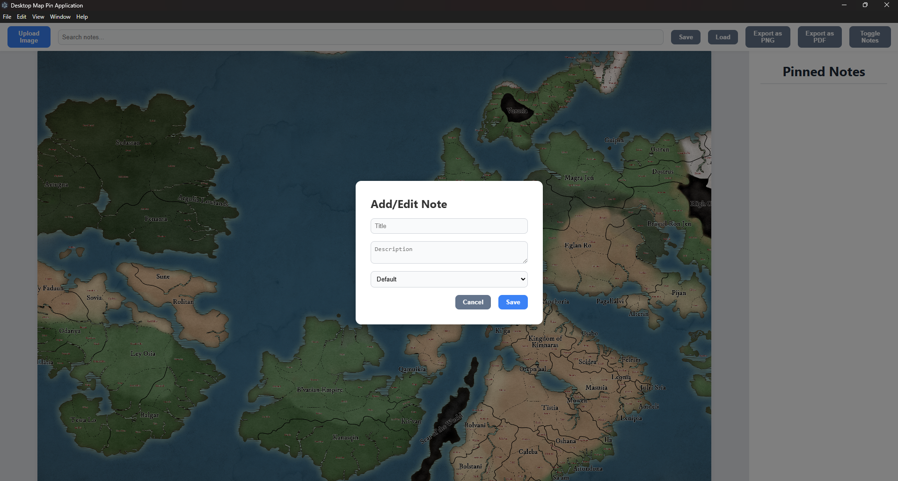
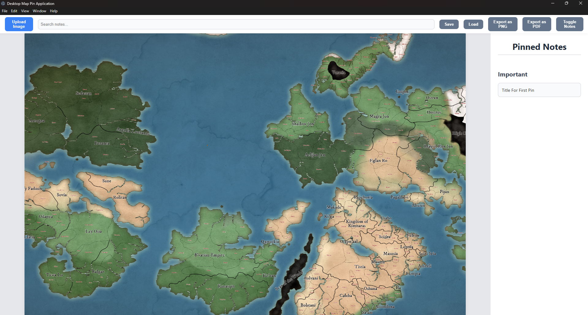
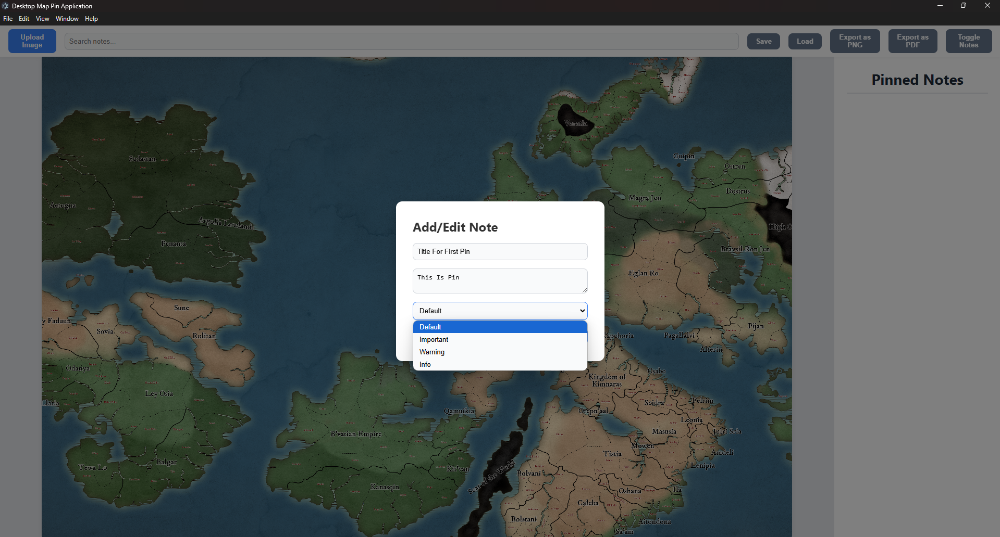
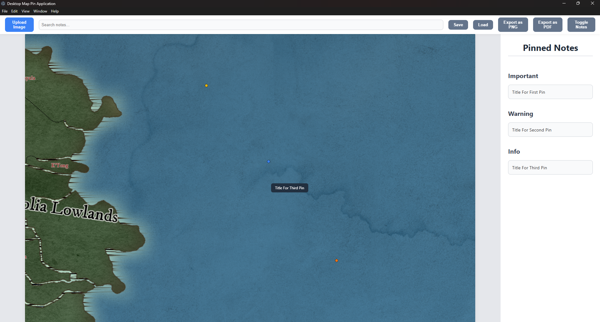

# 📍 Desktop Image Annotation with Pin Notes

A modern Electron desktop app that lets users annotate images using interactive pins with notes and export them as PNG or PDF. Designed for offline use, it features session saving/loading, smooth zoom and drag, note tagging, and context-aware editing — all inside a responsive canvas interface.

---

## 🚀 Key Features

- 📌 Add customizable pins with titles, descriptions, and tags
- 🖼 Zoomable, pannable canvas with real-time rendering
- 💾 Save and load annotated image sessions (JSON)
- 🖨 Export full-resolution annotated images to PNG or PDF
- 🧠 Hover tooltips, context menus, and categorized note sidebar
- 💻 Offline-first with Electron.js — no internet required

---

## 🛠 Tech Stack

- **Electron** for native desktop runtime
- **HTML5 Canvas** for interactive image rendering
- **Tailwind CSS** for styling
- **jsPDF** for exporting images to PDF
- **Node.js (fs + dialog)** for file handling

---

## 📦 Installation

```bash
# Clone this repository
git clone https://github.com/umerdev228/desktop-map-pin-app.git
cd desktop-map-pin-app

# Install dependencies
npm install

# Run the app in development mode
npm run dev
```


## 📸 Screenshots







---

## 🧪 Building Production App

```bash
# Build Windows executable
npm run build
```

Output files will be available in the `dist/` folder (configured via `electron-builder`).

---

## 📄 License

This project is licensed under the **ISC License**.

---

## 👨‍💻 Author

**Muhammad Umer**  
Full Stack Developer | Laravel · Vue.js · Electron.js  
[LinkedIn](https://www.linkedin.com/in/muhammad-umer-18b2b42b5/) | [Upwork](https://www.upwork.com/freelancers/~01821b9705dd1d1efb) | [Fiverr](https://fiverr.com/umer_dev) | [Email](mailto:umerdev228@gmail.com)

---
